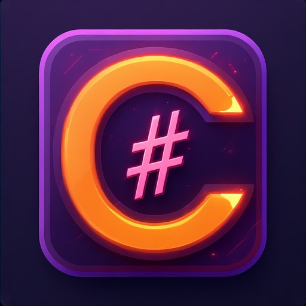

  

<h1 align="center">Insait Edit — C# IDE</h1>

  <b>A full-cycle desktop IDE for creating, editing, building, publishing, and packaging .NET desktop applications.</b>

  
  
  
  
  

  <a href="#english">🇬🇧 English</a> · <a href="#deutsch">🇩🇪 Deutsch</a>

---

## English

## Overview

**Insait Edit** is a Windows desktop IDE focused on C# and .NET desktop development. The application combines a custom editor, Roslyn-based analysis, project creation tools, build and publish workflows, Git integration, a built-in terminal, and MSIX packaging tools in one interface.

The current codebase is centered on desktop application workflows. It includes built-in project creation for **Avalonia**, **Windows Forms**, standard **console/class library** templates, and **F#** starter templates. The build and run pipeline also recognizes **WPF**, **WinForms**, and **Avalonia** GUI projects.

---

## Feature Highlights

### Full-cycle desktop workflow
- Create new solutions and projects from the IDE
- Add projects and items to an existing solution
- Work with C#, F#, AXAML, XAML, images, and project assets
- Build, rebuild, run, stop, publish, and package desktop applications

### Supported project workflows
- **Avalonia applications** with AXAML editing and preview support
- **Windows Forms applications** via project templates and GUI project detection
- **WPF projects** in the build/run pipeline
- **Console apps**, **class libraries**, **empty C# projects**, and **F# starter projects**

### Editor and code intelligence
- Custom `Insait Editor` with syntax highlighting and editor surface rendering
- Roslyn-backed C# completion, quick info, symbol lookup, and refactoring helpers
- F# completion and tooltip support through `FSharp.Compiler.Service`
- AXAML/XAML completion for Avalonia elements, properties, events, markup extensions, and namespaces
- Inline diagnostics, quick-fix suggestions, and auto-fix workflows inside the editor

### Build, run, and publish
- MSBuild / `dotnet` integration for project build operations
- Run configurations and compound run support
- GUI-aware run pipeline for desktop app projects
- Publish window with visual progress reporting

### Package management and deployment
- NuGet panel for browsing, installing, updating, and removing packages
- MSIX manager for packaging, metadata editing, icon replacement, and signing

### Source control and GitHub tooling
- Git panel for repository status, staged/unstaged changes, branch info, history, commit, push, and pull operations
- Repository cloning workflows
- GitHub integration through Octokit-based services
- Integrated **GitHub Copilot CLI** panel and command workflow

### Terminal and workspace utilities
- Built-in terminal panel with process control and command history
- File explorer, search in files, image viewer, notifications, encoding tools, and project property windows
- AXAML preview windows and live-host style preview tooling

### Localization
- Built-in UI dictionaries for **English, Ukrainian, German, Russian, and Turkish**
- Custom AXAML-based language dictionaries loaded at runtime
- Import of external `.axaml` translation files from the language menu
- Translation workspace folder for manual editing or GitHub Copilot CLI-assisted translation

---

## Roslyn Analysis and Completion System

The core coding experience is based on **Microsoft Roslyn** and several dedicated services in the project.

### What is implemented
- `RoslynAutoCompleteFactory` delegates C# completion directly to Roslyn `CompletionService`
- Signature help is resolved from Roslyn semantic data
- Hover information uses Roslyn `QuickInfoService`
- `InlineDiagnosticService` runs debounced background analysis and updates inline squiggles
- Quick-fix suggestions are attached to diagnostics and shown in the editor
- `RoslynAutoFixService` discovers built-in Roslyn `CodeFixProvider` and `CodeRefactoringProvider` implementations
- `CSharpCompletionService` supports rename operations and document highlights

### Practical result in the IDE
- smart completion lists
- parameter and overload help
- hover descriptions
- real-time error/warning reporting
- one-step quick fixes
- go to definition
- rename symbol

For AXAML files, the IDE uses a separate completion engine that reflects real Avalonia assemblies and suggests valid controls, properties, attached properties, events, and markup extensions.

---

## MSIX Packaging Notes

The MSIX subsystem supports both **full packaging** and **packaging from an already published output**.

### What the MSIX tools can do
- publish a project and pack it into MSIX in one flow
- generate `AppxManifest.xml`
- pack content with `MakeAppx.exe`
- open an existing MSIX and read package metadata
- edit package metadata and repack the package
- replace icons inside an existing MSIX
- sign an MSIX with `SignTool.exe` and a certificate from `CurrentUser\My`

### Important requirements
- **Windows SDK is required** for MSIX packaging because `MakeAppx.exe` and `SignTool.exe` are used
- the **package Publisher must match the certificate subject exactly**
- in practice this means the **`CN=...` publisher name must be identical to the certificate subject distinguished name**
- package icons for MSIX must be **PNG-based**
- if no valid logo is supplied, the service can fall back to a placeholder image

### Recommended usage notes
- set your own package icon explicitly; the default fallback is only a placeholder/mock value
- verify the package identity, publisher, version, executable, and entry point before signing
- if signing fails because of a publisher mismatch, align the manifest publisher with the certificate subject

---

## Localization and Custom Translation Workflow

Custom translations are handled through plain AXAML dictionaries.

### Built-in behavior
- Standard interface languages are loaded from `Insait Edit C Sharp/Interface Localization/`
- Custom dictionaries are stored in `%AppData%\InsaitEdit\GitHubTranslations\`
- The service ensures that a copy of `English.axaml` is available as the base template

### Custom translation rules
- a custom language file must be a plain `.axaml` dictionary
- it should keep the **same `x:String` key structure** as the English dictionary
- values can be translated, but keys and structure should remain identical to `English.axaml`

### How custom translations are used in the app
- import an external AXAML file from the language menu
- open the translations folder and edit the files manually
- launch **GitHub Copilot CLI** in that folder to assist with translation work
- load the custom dictionary directly from the language menu at runtime

---

## Keyboard Shortcuts

Below is the shortcut list confirmed by the current code.

### Main window
| Shortcut | Action |
|---|---|
| `Ctrl+S` | Save current file |
| `Ctrl+Shift+S` | Save all files |
| `Ctrl+O` | Open file |
| `Ctrl+N` | Create a new file |
| `Ctrl+Shift+N` | Create a new project |
| `Ctrl+B` | Build project |
| `Ctrl+Shift+B` | Rebuild project |
| `Ctrl+Shift+A` | Analyze project |
| `F5` | Run project |
| `Shift+F5` | Stop running project |
| `Ctrl+W` | Close current tab |
| `Ctrl+Shift+F` | Find in files |
| `Ctrl+P` | Find file by name |
| `Ctrl+Shift+Z` | Toggle Zen Mode |
| `Ctrl+Shift+P` | Open AXAML preview |
| `Ctrl+Shift+E` | Toggle Explorer panel |
| `Ctrl+Shift+I` | Toggle AI / right panel |
| `Ctrl+\`` | Toggle bottom panel / terminal area |
| `Esc` | Exit Zen Mode |

### Editor
| Shortcut | Action |
|---|---|
| `Alt+Enter` | Show quick fix at cursor |
| `Ctrl+.` | Show quick fix at cursor |
| `Ctrl+Shift+I` | Format document |
| `Ctrl+Shift+A` | Open Auto Fix window |
| `F12` | Go to definition |
| `F2` | Rename symbol |
| `Ctrl+R` | Rename symbol |
| `Ctrl+Shift+H` | Show hover info |
| `Tab` / `Enter` | Commit selected completion item |
| `Esc` | Close completion or quick-fix popup |

### Terminal panel
| Shortcut | Action |
|---|---|
| `Ctrl+C` | Stop the current terminal process |
| `Ctrl+L` | Clear terminal output |
| `Up / Down` | Navigate terminal history |

---

## Technology Summary

| Component | Technology |
|---|---|
| Target framework | `.NET 10.0` (`net10.0-windows`) |
| UI framework | `Avalonia 12.0.0` |
| Code analysis | Roslyn 5.x |
| F# support | `FSharp.Compiler.Service` 43.x |
| Build layer | `Microsoft.Build` 18.4 |
| NuGet integration | `NuGet.Protocol` 7.3 |
| GitHub integration | `Octokit` 14.0 |
| Local storage | `LiteDB` 6 prerelease |

---

## License

This project is licensed under the **MIT License** — see the [LICENSE](LICENSE) file for details.

> **Note:** the application's UI styles, icons, and visual assets are excluded from the MIT License and remain All Rights Reserved. See [LICENSE](LICENSE) for the full exclusion list.

---

## Deutsch

## Überblick

**Insait Edit** ist eine Windows-Desktop-IDE mit Fokus auf C#- und .NET-Desktopentwicklung. Die Anwendung kombiniert einen eigenen Editor, Roslyn-basierte Analyse, Werkzeuge zum Erstellen von Projekten, Build- und Publish-Workflows, Git-Integration, ein integriertes Terminal und MSIX-Paketierung in einer Oberfläche.

Die aktuelle Codebasis konzentriert sich auf Desktop-Anwendungen. Enthalten sind integrierte Projektvorlagen für **Avalonia**, **Windows Forms**, Standardvorlagen für **Konsole/Klassenbibliothek** sowie **F#-Startvorlagen**. Die Build- und Run-Pipeline erkennt außerdem **WPF**, **WinForms** und **Avalonia** als GUI-Projekte.

---

## Funktionsübersicht

### Vollständiger Desktop-Workflow
- Neue Lösungen und Projekte direkt in der IDE erstellen
- Projekte und Elemente zu bestehenden Lösungen hinzufügen
- Mit C#, F#, AXAML, XAML, Bildern und Projektressourcen arbeiten
- Desktopanwendungen bauen, neu bauen, starten, stoppen, veröffentlichen und als Paket erstellen

### Unterstützte Projekt-Workflows
- **Avalonia-Anwendungen** mit AXAML-Bearbeitung und Vorschau
- **Windows-Forms-Anwendungen** über Projektvorlagen und GUI-Erkennung
- **WPF-Projekte** in der Build-/Run-Pipeline
- **Konsolenanwendungen**, **Klassenbibliotheken**, **leere C#-Projekte** und **F#-Startprojekte**

### Editor und Code-Intelligenz
- Eigenentwickelter `Insait Editor` mit Syntaxhervorhebung und eigener Rendering-Oberfläche
- Roslyn-basierte C#-Vervollständigung, Quick Info, Symbolsuche und Refactoring-Helfer
- F#-Vervollständigung und Tooltip-Unterstützung über `FSharp.Compiler.Service`
- AXAML/XAML-Vervollständigung für Avalonia-Elemente, Eigenschaften, Events, Markup Extensions und Namespaces
- Inline-Diagnosen, Quick-Fix-Vorschläge und Auto-Fix-Workflows direkt im Editor

### Build, Run und Publish
- Integration von MSBuild / `dotnet` für Build-Vorgänge
- Run-Konfigurationen und Compound-Run-Unterstützung
- GUI-bewusste Startlogik für Desktopprojekte
- Publish-Fenster mit visueller Fortschrittsanzeige

### Paketverwaltung und Deployment
- NuGet-Panel zum Suchen, Installieren, Aktualisieren und Entfernen von Paketen
- MSIX-Manager für Paketierung, Metadatenbearbeitung, Icon-Austausch und Signierung

### Quellcodeverwaltung und GitHub-Werkzeuge
- Git-Panel für Repository-Status, gestagte/nicht gestagte Änderungen, Branch-Infos, Verlauf, Commit, Push und Pull
- Workflows zum Klonen von Repositories
- GitHub-Integration über Octokit-basierte Dienste
- Integriertes **GitHub Copilot CLI**-Panel und Befehlsworkflow

### Terminal und Workspace-Werkzeuge
- Eingebautes Terminal mit Prozesssteuerung und Befehlsverlauf
- Datei-Explorer, Suche in Dateien, Bildbetrachter, Benachrichtigungen, Encoding-Werkzeuge und Eigenschaftsfenster
- AXAML-Vorschaufenster und Live-Host-ähnliche Vorschauwerkzeuge

### Lokalisierung
- Eingebaute UI-Wörterbücher für **Englisch, Ukrainisch, Deutsch, Russisch und Türkisch**
- Benutzerdefinierte AXAML-Sprachdateien, die zur Laufzeit geladen werden können
- Import externer `.axaml`-Übersetzungsdateien über das Sprachmenü
- Übersetzungsordner für manuelle Bearbeitung oder Übersetzungen mit Unterstützung durch GitHub Copilot CLI

---

## Roslyn-Analyse- und Vervollständigungssystem

Das Coding-Erlebnis basiert im Kern auf **Microsoft Roslyn** und mehreren spezialisierten Diensten im Projekt.

### Implementierte Bausteine
- `RoslynAutoCompleteFactory` delegiert die C#-Vervollständigung direkt an Roslyn `CompletionService`
- Signaturhilfe wird aus semantischen Roslyn-Daten aufgelöst
- Hover-Informationen verwenden Roslyn `QuickInfoService`
- `InlineDiagnosticService` führt entprellte Hintergrundsanalyse aus und aktualisiert Inline-Markierungen
- Quick-Fix-Vorschläge werden an Diagnosen angehängt und im Editor angezeigt
- `RoslynAutoFixService` entdeckt eingebaute Roslyn-`CodeFixProvider`- und `CodeRefactoringProvider`-Implementierungen
- `CSharpCompletionService` unterstützt Symbolumbenennung und Dokument-Highlights

### Ergebnis in der Praxis
- intelligente Vervollständigungslisten
- Parameter- und Überladungshilfe
- Hover-Beschreibungen
- Echtzeit-Fehler- und Warnmeldungen
- Quick Fix mit einem Schritt
- Gehe zu Definition
- Symbol umbenennen

Für AXAML-Dateien verwendet die IDE zusätzlich eine eigene Vervollständigungs-Engine, die reale Avalonia-Assemblies reflektiert und gültige Controls, Eigenschaften, Attached Properties, Events und Markup Extensions vorschlägt.

---

## Hinweise zur MSIX-Paketierung

Das MSIX-Subsystem unterstützt sowohl die **vollständige Paketierung** als auch die **Paketierung aus einem bereits veröffentlichten Output**.

### Was die MSIX-Werkzeuge können
- ein Projekt veröffentlichen und in einem Durchlauf als MSIX paketieren
- `AppxManifest.xml` erzeugen
- Inhalte mit `MakeAppx.exe` packen
- ein vorhandenes MSIX öffnen und Paketmetadaten lesen
- Paketmetadaten bearbeiten und das Paket neu packen
- Icons innerhalb eines vorhandenen MSIX ersetzen
- ein MSIX mit `SignTool.exe` und einem Zertifikat aus `CurrentUser\My` signieren

### Wichtige Anforderungen
- für die MSIX-Paketierung wird das **Windows SDK** benötigt, da `MakeAppx.exe` und `SignTool.exe` verwendet werden
- der **Publisher** des Pakets muss exakt mit dem Zertifikatssubjekt übereinstimmen
- praktisch bedeutet das: der **`CN=...`-Name des Herstellers muss identisch mit dem Distinguished Name des Zertifikats** sein
- Paketicons für MSIX müssen **PNG-basiert** sein
- wenn kein gültiges Logo angegeben wird, kann der Dienst ein Platzhalterbild einsetzen

### Empfohlene Hinweise für die Nutzung
- setzen Sie Ihr eigenes Paketicon explizit; der Standardwert ist nur ein Platzhalter/Mock-Wert
- prüfen Sie vor dem Signieren Paketidentität, Publisher, Version, Executable und EntryPoint
- wenn das Signieren wegen eines Publisher-Mismatches fehlschlägt, muss der Manifest-Publisher auf das Zertifikatssubjekt angepasst werden

---

## Lokalisierung und benutzerdefinierte Übersetzungen

Benutzerdefinierte Übersetzungen werden über einfache AXAML-Wörterbücher verwaltet.

### Eingebautes Verhalten
- Standardsprachen werden aus `Insait Edit C Sharp/Interface Localization/` geladen
- Benutzerdefinierte Wörterbücher werden in `%AppData%\InsaitEdit\GitHubTranslations\` gespeichert
- der Dienst stellt sicher, dass `English.axaml` als Basistemplate verfügbar ist

### Regeln für benutzerdefinierte Übersetzungen
- eine benutzerdefinierte Sprachdatei muss ein einfaches `.axaml`-Wörterbuch sein
- sie sollte die **gleiche `x:String`-Schlüsselstruktur** wie das englische Wörterbuch besitzen
- Werte dürfen übersetzt werden, Schlüssel und Struktur sollten jedoch identisch zu `English.axaml` bleiben

### Nutzung im Programm
- externe AXAML-Datei über das Sprachmenü importieren
- den Übersetzungsordner öffnen und Dateien manuell bearbeiten
- **GitHub Copilot CLI** in diesem Ordner starten, um bei der Übersetzung zu helfen
- das benutzerdefinierte Wörterbuch direkt zur Laufzeit über das Sprachmenü laden

---

## Tastenkombinationen

Die folgende Liste basiert auf den aktuell im Code bestätigten Shortcuts.

### Hauptfenster
| Tastenkombination | Aktion |
|---|---|
| `Strg+S` | Aktuelle Datei speichern |
| `Strg+Umschalt+S` | Alle Dateien speichern |
| `Strg+O` | Datei öffnen |
| `Strg+N` | Neue Datei erstellen |
| `Strg+Umschalt+N` | Neues Projekt erstellen |
| `Strg+B` | Projekt bauen |
| `Strg+Umschalt+B` | Projekt neu bauen |
| `Strg+Umschalt+A` | Projekt analysieren |
| `F5` | Projekt starten |
| `Umschalt+F5` | Laufendes Projekt stoppen |
| `Strg+W` | Aktuellen Tab schließen |
| `Strg+Umschalt+F` | In Dateien suchen |
| `Strg+P` | Datei nach Namen suchen |
| `Strg+Umschalt+Z` | Zen-Modus umschalten |
| `Strg+Umschalt+P` | AXAML-Vorschau öffnen |
| `Strg+Umschalt+E` | Explorer umschalten |
| `Strg+Umschalt+I` | KI-/rechte Seitenleiste umschalten |
| `Strg+\`` | Unteres Panel / Terminalbereich umschalten |
| `Esc` | Zen-Modus verlassen |

### Editor
| Tastenkombination | Aktion |
|---|---|
| `Alt+Enter` | Quick Fix an der Cursorposition anzeigen |
| `Strg+.` | Quick Fix an der Cursorposition anzeigen |
| `Strg+Umschalt+I` | Dokument formatieren |
| `Strg+Umschalt+A` | Auto-Fix-Fenster öffnen |
| `F12` | Gehe zu Definition |
| `F2` | Symbol umbenennen |
| `Strg+R` | Symbol umbenennen |
| `Strg+Umschalt+H` | Hover-Information anzeigen |
| `Tab` / `Enter` | Ausgewählten Completion-Eintrag übernehmen |
| `Esc` | Completion- oder Quick-Fix-Popup schließen |

### Terminal-Panel
| Tastenkombination | Aktion |
|---|---|
| `Strg+C` | Aktuellen Terminalprozess stoppen |
| `Strg+L` | Terminalausgabe leeren |
| `Pfeil hoch / runter` | Terminalverlauf durchsuchen |

---

## Technologieübersicht

| Komponente | Technologie |
|---|---|
| Zielframework | `.NET 10.0` (`net10.0-windows`) |
| UI-Framework | `Avalonia 12.0.0` |
| Codeanalyse | Roslyn 5.x |
| F#-Unterstützung | `FSharp.Compiler.Service` 43.x |
| Build-Layer | `Microsoft.Build` 18.4 |
| NuGet-Integration | `NuGet.Protocol` 7.3 |
| GitHub-Integration | `Octokit` 14.0 |
| Lokaler Speicher | `LiteDB` 6 Prerelease |

---

## Lizenz

Dieses Projekt steht unter der **MIT-Lizenz** — Details finden Sie in der Datei [LICENSE](LICENSE).

> **Hinweis:** Die UI-Stile, Icons und visuellen Assets der Anwendung sind von der MIT-Lizenz ausgenommen und bleiben All Rights Reserved. Die vollständige Ausschlussliste steht in [LICENSE](LICENSE).

